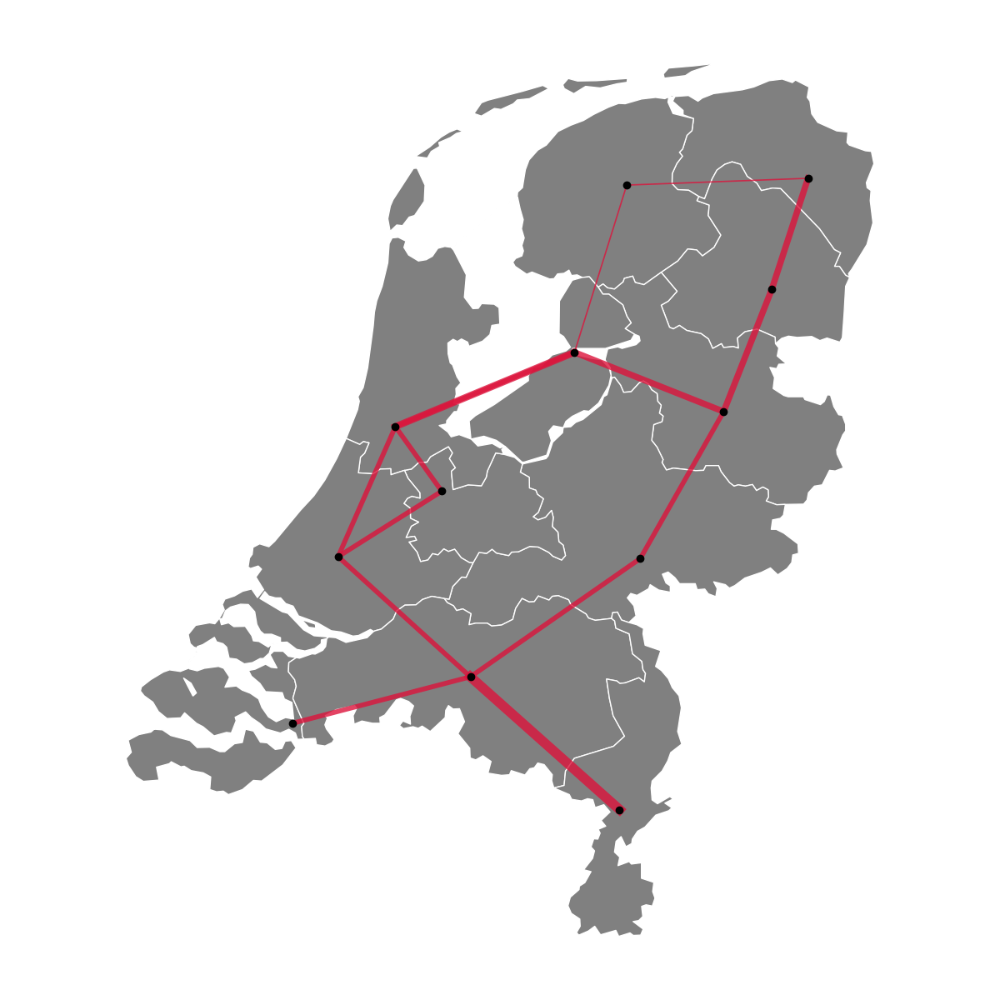

# Calliope-NL
A model of the Dutch power system with data at both simplified-NUTS3 (22 nodes) and NUTS2 (province-scale, 12 nodes) spatial resolutions. Neighbouring countries are represented by 5 additional simplified nodes in each case. The model is, for now, conceived primarily for education or research prototyping (e.g., algorithm testing) purposes.

## Requirements
The model is built on the Python-based open-source energy modelling framework Calliope, version 0.7.0.dev6. 
To be ready to run the model, we recommend following the [instructions for installing Calliope](https://calliope.readthedocs.io/en/v0.7.0.dev5/installation/) first.

## Overview
The repository includes a Jupyter notebook (`example_design_optimisation.ipynb`) to walk new users through the most typical use of the model, namely the generation of cost-optimal system design plans, including illustrative analysis and visualisation options. The visualisation functions are imported from the file `plotting_functionalities.py`. 

A second notebook (`example_operation_robustness_test.ipynb`) showcases how to re-run a previously identified cost-optimal system design under varying operating conditions, such as cheaper prices for importing electricity from abroad. This second notebook is accompanied by a Python script (`convert_plan_to_fixed_design.py`), which the notebook imports as a function to enable the automated creation of a scenario that fixes the system design to what was found previously in 'plan' mode. 

In addition, the repository includes the Jupyter notebook `example_exploring_design_options.ipynb` to illustrate the use of the SPORES algorithm, which generates many alternative system planning options within a given cost range. SPORES belongs to the family of 'Modelling to Generate Alternatives' (MGA) methods and is further documented elsewhere (e.g., in [Lombardi et al., 2023](https://doi.org/10.1016/j.apenergy.2023.121002)). Although Calliope provides an in-buitl SPORES functionality, this model utilises an external `spores_algorithm.py` script and some custom math and scenarios (see below), so that algorithm modifications can be more easily implemented and tested.

All input data and model specifications are in the `model_files` directory. In particular, the directory includes the master `model.yaml` file, which defines the main model features and imports all other YAML files with additional details. The `/scenarios` directory includes all files to apply model modifications (i.e., 'scenarios' on the fly). For example, the `brownfield_caps.yaml` and `frozen_caps.yaml` enable, respectively, brownfield capacity expansion or fixing (i.e., 'freezing') the system to its current state for diagnostic analyses. The `fixed-design-cost-optimal.yaml` file, instead, is automatically created by the Jupyter notebook `example_operation_robustness_test.ipynb` based on a previously found cost-optimal system design to allow re-running the same design with varying operation assumptions. The `spores.yaml` file specifies the overrides that enable the SPORES mode and which system features to focus on in generating design alternatives.

The time series data lie in the `/timeseries` sub-directory, while the characteristics of technologies, networks and nodes are in the `/techs_and_locs` sub-directory. The `/custom_math` directory, instead, includes the files that specify custom mathematical constraints, [one of the most exciting functionalities of the newest Calliope version](https://calliope.readthedocs.io/en/latest/user_defined_math/). The `/results` directory is envisioned to host the results generated by the included Jupyter notebooks. All files for which spatial resolution is relevant are duplicated for both the default resolution (i.e., simplified NUTS3) and the province-aggregated resolution (NUTS2); in the latter case, files explicitly include the string `nuts2` in their name.

The data sources are the following:
- Techno-economic technology data come from the Danish Energy Agency technology catalogues and are interpolated to represent projections to the year 2025
- Renewables time series come from the [renewables.ninja](www.renewables.ninja) project
- Demand time series come from Open Power System Data [(OPSD)](https://data.open-power-system-data.org/time_series/2020-10-06) and are regionalised proportionally to the GDP of each province
- Grid constraints are generated by making use of the [PyPSA-Eur workflow](https://github.com/pypsa/pypsa-eur) and its customisation to NUTS2/3 regions made by [Bobby Xiong](https://github.com/bobbyxng/kodekiste)
- Renewable potentials (land availability) are based on the cross-checking of two sources. First, the 'technical-social potential' from [Tröndle et al (2019)](https://zenodo.org/records/3244985); second, the outputs of the [PyPSA-Eur workflow](https://github.com/pypsa/pypsa-eur) and its customisation to NUTS2/3 regions made by [Bobby Xiong](https://github.com/bobbyxng/kodekiste). In both cases, adjustments are made based on the latest data available from the the Dutch Centraal Bureau voor de Statistiek (CBS).

## Limitations

The model currently comes with several limitations, which may make it less suitable for certain applications or questions. Some of the main limitations to keep in mind are listed below.
- Import and export of electricity from/to other countries is stylised as a source/sink of energy with symbolic prices and only limited by transmission bottlenecks
- The range of available technologies is limited, especially concerning conventional firm capacity
- Offshore wind time series are not spatially explicit, although solar and onshore wind time series are (up to the NUTS2 level)
- The expansion of transmission capacity is simplified: each intra-national line can be expanded to a maximum of 5x the current capacity, while international connectors are - by default - kept at the current capacity
- Technology costs are based on 2025 data (for data sources, see above); long-term planning questions may require the adjustment of such data to account for future technology cost evolutions

## Authors & contributors

Francesco Lombardi (_corresponding author_)  
E-mail: f.lombardi@tudelft.nl  
Webpage: www.flombardi.org
TU Delft, Faculty of Technology, Policy and Management  

Luca Lazzari  
TU Delft, Faculty of Technology, Policy and Management  
TU Delft, Faculty of Technology, Policy and Management  

Wouter van der Veen  
TU Delft, Faculty of Technology, Policy and Management  

## Citing
If you use Calliope-NL or the related data in your work, please cite this repository and its authors (see License).

## License
Copyright 2025 Calliope-NL, contributors listed in Authors & contributors

 This work is licensed under a <a rel="license" href="http://creativecommons.org/licenses/by-nc-sa/4.0/">Creative Commons Attribution-NonCommercial-ShareAlike 4.0 International License</a>.

Unless required by applicable law or agreed to in writing, software distributed under the License is distributed on an "AS IS" BASIS, WITHOUT WARRANTIES OR CONDITIONS OF ANY KIND, either express or implied. See the License for the specific language governing permissions and limitations under the License.
